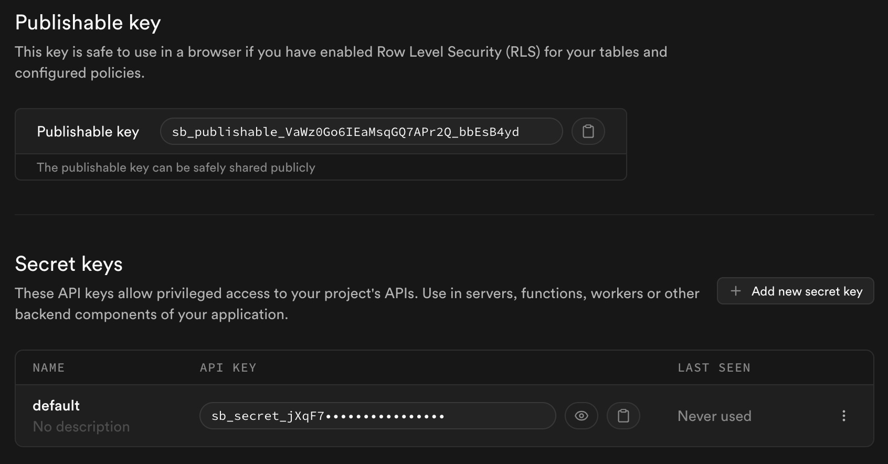

# Stytch Consumer Connected Apps MCP Auth with Supabase Auth in Next.js

This example app builds on the Supabase + Next.js Auth & User Management example by adding a Stytch Connected Apps flow, in order to power authentication for an MCP server.
This demo has:

- User signups using Supabase [Auth](https://supabase.com/auth).
  - Supabase [Auth Helpers for Next.js](https://supabase.com/docs/guides/auth/auth-helpers/nextjs).
- User avatar images using Supabase [Storage](https://supabase.com/storage)
- Public profiles restricted with [Policies](https://supabase.com/docs/guides/auth#policies).
- Frontend using [Next.js](<[nextjs.org/](https://nextjs.org/)>).
- OAuth Identity Provider functionality using Stytch [Connected Apps](https://stytch.com/docs/guides/connected-apps/overview).
- Lightweight MCP server with the [Vercel MCP Adapter](https://github.com/vercel/mcp-adapter).

## Technologies used

- Frontend:
  - [Next.js](https://github.com/vercel/next.js) - a React framework for production.
  - [Supabase.js](https://supabase.com/docs/library/getting-started) for user management and realtime data syncing.
  - Supabase [Auth Helpers for Next.js](https://supabase.com/docs/guides/auth/auth-helpers/nextjs).
  - Stytch [pre-built Identity Provider OAuth Authorization UI](https://stytch.com/docs/guides/connected-apps/getting-started).
- Backend:
  - [supabase.com/dashboard](https://supabase.com/dashboard/): hosted Postgres database with restful API for usage with Supabase.js.
  - [stytch.com/dashboard](https://stytch.com/dashboard/): identity provider for MCP auth

## What this app does

This app is a simple social blog. Users can sign up and set up their profile, and can post text to a shared blog as well as read their fellow users' posts.

## Setup script

Most of the steps below can be performed with the assistance of a setup script included in this repository. To get started, run:

```
yarn
yarn setup:localhost
```

This will guide you through the Supabase and Stytch setup, preparing you to run your server on http://localhost:3000. To deploy directly to Vercel, use `yarn setup:all`.

If you already have some parts of the setup flow done, you can choose to run specific setup steps.
You will be prompted to provide relevant parameters from other parts if they are not available:

```
yarn setup:supabase # no dependencies
yarn setup:stytch   # will ask for supabase parameters if not in .env.local
yarn setup:vercel   # will ask for supabase and stytch parameters if not in .env.local
```

## Supabase setup (4 steps)

### 1. Create new project

Sign up for a Supabase account - [https://supabase.com/dashboard](https://supabase.com/dashboard) and create a new project. Wait for your database to start.

Note that Supabase recently introduced asymmetric JWT signing, which we'll need in order for this demo to work. Follow the instructions in [this Supabase blog](https://supabase.com/blog/jwt-signing-keys#start-using-asymmetric-jwts-today) to migrate your new project to using these. TL;DR:

- You will create new asymmetric signing keys
- You will rotate to the new keys, thereby disabling the legacy symmetric secret (which Stytch does not support)
- You should generate new publishable + secret API keys and stop using the legacy anon + service role JWT-based API keys (which are signed using the legacy secret you revoked above)

To keep our user sign up flow simple, we will also disable email confirmations:

- Navigate to Authentication –> Sign in/Providers
- Disable "Confirm email"
- Save

This way, you'll be able to create a user without needing to verify the email address first. You should not do this in a production app, but for the purposes of this demo, it'll make the flow a bit simpler.

### 2. Run "User Management" quickstart

Once your database has started, head over to your project's `SQL Editor` and run the "User Management Starter" quickstart. On the `SQL editor` page, scroll down until you see `User Management Starter: Sets up a public Profiles table which you can access with your API`. Click that, then click `RUN` to execute that query and create a new `profiles` table. When that's finished, head over to the `Table Editor` and see your new `profiles` table.

### 3. Get the project URL and keys

Go to the Project Settings (the cog icon), open the API tab, and find your API URL and `publishable` key, you'll need these in the next step.

The `publishable` key is your client-side API key. It allows client-side access to your database, until the user has logged in. Once they have logged in, the keys will switch to the user's own login token. This enables row level security for your data. Read more about this [below](#postgres-row-level-security).



**_NOTE_**: The `secret` key has full access to your data, bypassing any security policies. These keys have to be kept secret and are meant to be used in server environments and never on a client or browser.

If you're familiar with Stytch, think of the `publishable` key as your Stytch `public_token`, and the `secret` as your Stytch `secret`.

### 4. Set up environment variables

Copy and fill the dotenv template for local development `cp .env.example .env.local`. For deployed environments, consider setting variables directly in your Vercel deployment.

- `NEXT_PUBLIC_SUPABASE_URL`: your Project URL on the Data API page under Project Settings (`https://<project-id>.supabase.co`)
- `NEXT_PUBLIC_SUPABASE_PUBLISHABLE_KEY`: your `publishable` key from above (`sb_publishable_...`)
- `SUPABASE_SECRET_KEY`: your `secret` key from above (`sb_secret_...`)
  - ‼️ this is a sensitive value – do NOT git commit the secret for your production environment in plaintext ‼️

## Vercel setup (4 steps)

### 1. Push your project to a GitHub repository

Vercel makes it easy to deploy projects from GitHub repositories, so push your code to a repository and connect your GitHub account to your Vercel account.

### 2. Create new project

Use the Next.js framework preset and set the build and install commands appropriately (`yarn build` and `yarn`).


### 3. Set up environment variables

Paste the contents of `.env.production.example` to fill placeholders in the environment variables form. For now, don't add the `SUPABASE_SECRET` or `STYTCH_SECRET` – Vercel will let you add sensitive values later, such that members of your team cannot read them once they've been set.

If you haven't done the Stytch setup steps yet (below), feel free to leave out the Stytch environment variables for now. You can add them and redeploy later – there's a bit of a dependency loop here, so you'll need to deploy your Vercel project first anyway (so that you can get a Vercel URL).

### 4. Set up sensitive environment variables

After your deployment is ready, go to your project settings and find the Environment Variables tab. There, add your `SUPABASE_SECRET` (and, later, `STYTCH_SECRET`) to the `production` environment as sensitive values.
This will ensure that they aren't transmitted to the Vercel dashboard once they've been set (i.e. your team cannot view them).

## Stytch setup (4 steps)

### 1. Create new project

Sign up for a Stytch account - [https://stytch.com/dashboard](https://stytch.com/dashboard) and create a new consumer/B2C project.

- Configure the Frontend SDK – [https://stytch.com/dashboard/sdk-configuration](https://stytch.com/dashboard/sdk-configuration)
  - Enable the SDK and add `https://<your-vercel-url>` as an authorized domain

### 2. Create trusted auth profile

We're using Supabase as our primary auth provider. In order to allow Stytch to provision users and sessions based on Supabase auth tokens, we'll need to create a Trusted Auth Profile:

- Navigate to [https://stytch.com/dashboard/trusted-auth-tokens](https://stytch.com/dashboard/trusted-auth-tokens)
- Create a new profile
- Set the name to something recognizable, e.g. `Supabase`
- Set the audience to `authenticated`
- Set the issuer to your Supabase URL (see Step 3 in the Supabase setup above)
- Set "Allow JIT Provisioning" to on – this will allow Stytch to create new users based on your Supabase tokens automatically
- Set the JWKS URL to `https://<your-supabase-url>/auth/v1/.well-known/jwks.json`
- Map the `email` attribute to `email`, `token_id` to `sub`, and `external_member_id` to `sub`

### 3. Configure connected apps

In order for MCP clients to be able to connect to our server dynamically, we need to allow dynamic client registration. We also need to set the URL of our OAuth Authorization page.

- Navigate to [https://stytch.com/dashboard/connected-apps](https://stytch.com/dashboard/connected-apps)
- Set the authorization URL to `https://<your-vercel-url>/oauth/authorize`
- Set "Allow dynamic client registration" to on

### 4. Set up environment variables

Fill the dotenv template for local development in `.env.local` (as you did in the Supabase setup). For deployed environments, consider setting variables directly in your Vercel deployment.

- `STYTCH_PROJECT_ID`: the Project ID from the [Project Overview](https://stytch.com/dashboard) (`project-test-...`)
- `STYTCH_SECRET`: a Project Secret from the [Project Overview](https://stytch.com/dashboard) (`secret-test-...`)
  - ‼️ this is a sensitive value – do NOT git commit the secret for your _live_ environments in plaintext ‼️
- `STYTCH_IDP_DOMAIN`: the Project Domain from the [Project Overview](https://stytch.com/dashboard) (`https://randomizedname.customers.stytch.dev`)
- `NEXT_PUBLIC_STYTCH_PUBLIC_TOKEN`: a Public Token from the [Project Overview](https://stytch.com/dashboard) (`public-token-test-...`)
- `NEXT_PUBLIC_STYTCH_TOKEN_PROFILE`: the Profile ID from the Trusted Auth Profile you created in Step 2 (`trusted-token-profile-test-...`)

If you're familiar with Supabase, think of the `public_token` as your Supabase `publishable` key, and the `secret` as your Supabase `secret`.

## Running Locally

Once you've setup a `.env.local` file, you can run the project locally to test it out. Just note that you will have to change your Authorization URL (Stytch setup step 3) to `http://localhost:3000/oauth/authorize` before you begin.

1. Install dependencies: `yarn`
2. Start the server: `yarn dev`
3. Navigate to `http://localhost:3000` and sign up/log in

## Connecting to the MCP server

Whether your app is running locally or on Vercel, you can connect to your MCP server using a variety of clients. We'll use the MCP Inspector for this example:

1. Start the inspector: `yarn dlx @modelcontextprotocol/inspector@latest`
2. In the window, set your Transport Type to `Streamable HTTP`
3. Set your URL to `http://localhost:3000/mcp` or `https://<your-vercel-url>/mcp`
4. Click `Connect`

You should be prompted to (sign up/log in and) authorize access to your account from your app's authorization screen. Once you click Allow, you should be redirected to the inspector and be able to use various resources and tools.

In Supabase, this should result in your Profile being created (if you just signed up) or updated (if you use the update tool). In Stytch, this should result in a new Connected App being dynamically registered (the first time you connect) and a user being JIT provisioned (when you click Allow).

## More Stytch Examples & Resources

Coming soon!

## Authors

- [Stytch](https://stytch.com)
- [Supabase](https://supabase.com)

## Appendix

### Postgres Row level security

This project uses very high-level Authorization using Postgres' Row Level Security.
When you start a Postgres database on Supabase, we populate it with an `auth` schema, and some helper functions.
When a user logs in, they are issued a JWT with the role `authenticated` and their UUID.
We can use these details to provide fine-grained control over what each user can and cannot do.

This is a trimmed-down schema, with the policies:

```sql
-- Create a table for public profiles
create table profiles (
  id uuid references auth.users not null primary key,
  updated_at timestamp with time zone,
  username text unique,
  full_name text,
  avatar_url text,
  website text,

  constraint username_length check (char_length(username) >= 3)
);
-- Set up Row Level Security (RLS)
-- See https://supabase.com/docs/guides/auth/row-level-security for more details.
alter table profiles
  enable row level security;

create policy "Public profiles are viewable by everyone." on profiles
  for select using (true);

create policy "Users can insert their own profile." on profiles
  for insert with check ((select auth.uid()) = id);

create policy "Users can update own profile." on profiles
  for update using ((select auth.uid()) = id);

-- This trigger automatically creates a profile entry when a new user signs up via Supabase Auth.
-- See https://supabase.com/docs/guides/auth/managing-user-data#using-triggers for more details.
create function public.handle_new_user()
returns trigger as $$
begin
  insert into public.profiles (id, full_name, avatar_url)
  values (new.id, new.raw_user_meta_data->>'full_name', new.raw_user_meta_data->>'avatar_url');
  return new;
end;
$$ language plpgsql security definer;
create trigger on_auth_user_created
  after insert on auth.users
  for each row execute procedure public.handle_new_user();

-- Set up Storage!
insert into storage.buckets (id, name)
  values ('avatars', 'avatars');

-- Set up access controls for storage.
-- See https://supabase.com/docs/guides/storage#policy-examples for more details.
create policy "Avatar images are publicly accessible." on storage.objects
  for select using (bucket_id = 'avatars');

create policy "Anyone can upload an avatar." on storage.objects
  for insert with check (bucket_id = 'avatars');

create policy "Anyone can update their own avatar." on storage.objects
  for update using ( auth.uid() = owner ) with check (bucket_id = 'avatars');
```
